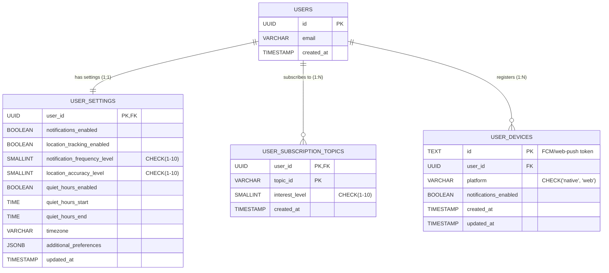

```mermaid
erDiagram
    USERS {
        UUID id PK
        VARCHAR email
        TIMESTAMP created_at
    }
    
    USER_SETTINGS {
        UUID user_id PK, FK
        BOOLEAN notifications_enabled
        BOOLEAN location_tracking_enabled
        SMALLINT notification_frequency_level "CHECK(1-10)"
        SMALLINT location_accuracy_level "CHECK(1-10)"
        BOOLEAN quiet_hours_enabled
        TIME quiet_hours_start
        TIME quiet_hours_end
        VARCHAR timezone
        JSONB additional_preferences
        TIMESTAMP updated_at
    }
    
    USER_SUBSCRIPTION_TOPICS {
        UUID user_id PK, FK
        VARCHAR topic_id PK
        SMALLINT interest_level "CHECK(1-10)"
        TIMESTAMP created_at
    }
    
    USER_DEVICES {
        TEXT id PK "FCM/web-push token"
        UUID user_id FK
        VARCHAR platform "CHECK('native', 'web')"
        BOOLEAN notifications_enabled
        TIMESTAMP created_at
        TIMESTAMP updated_at
    }

    USERS ||--|| USER_SETTINGS : "has settings (1:1)"
    USERS ||--o{ USER_SUBSCRIPTION_TOPICS : "subscribes to (1:N)"
    USERS ||--o{ USER_DEVICES : "registers (1:N)"
```
